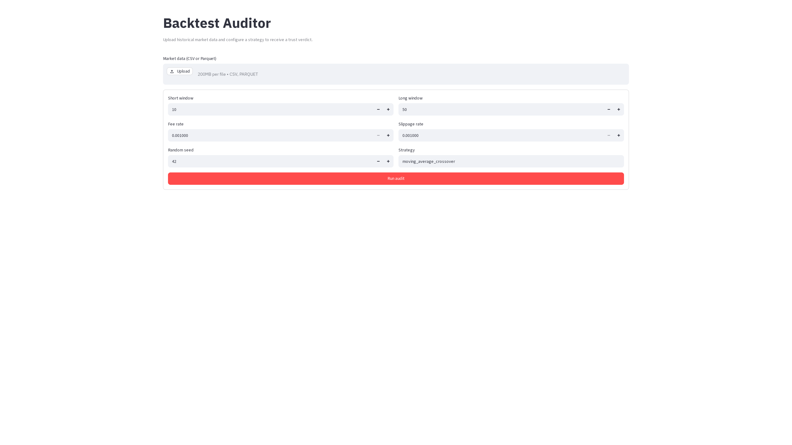
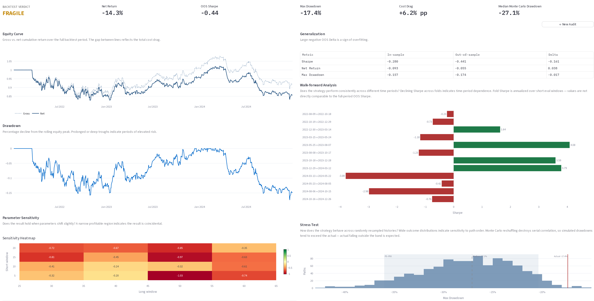

# Backtest Auditor

A quantitative validation tool for testing whether a trading backtest remains credible after costs, out-of-sample testing, parameter sensitivity, and Monte Carlo stress testing.

> A strategy that looks profitable in-sample often deteriorates significantly after realistic costs and out-of-sample validation. This tool measures how much.

---

## Overview

Most backtests are optimistic by construction. They are run on the full available history, ignore transaction costs, and are never tested outside the period used to develop them. When the same strategy is applied to new data, performance frequently collapses.

Backtest Auditor runs a structured diagnostic sequence:

- Applies transaction costs and execution timing constraints to gross returns
- Splits the data into in-sample and out-of-sample periods
- Runs walk-forward validation across rolling windows
- Tests parameter sensitivity across a grid of nearby configurations
- Stress-tests drawdown via bootstrap resampling and Monte Carlo reshuffling

The result is a single trust verdict — **ROBUST** or **FRAGILE** — backed by a full diagnostic report.

---

## Why This Matters

A large deterioration from in-sample to out-of-sample performance is a strong warning that the original result may not generalize.

Transaction costs compound this. In the demo result below, cost drag is 6.2 percentage points — amplifying a −8.1% gross loss to a −14.3% net loss over the full period.

Without systematic validation, neither of these problems is visible until real capital is at risk.

---

## Key Features

- **Cost-adjusted backtesting** — applies configurable fees and slippage to gross returns before any performance measurement
- **In-sample / out-of-sample split** — compares Sharpe, net return, and maximum drawdown across the two periods
- **Walk-forward validation** — constructs rolling train/evaluate windows and reports per-fold performance
- **Parameter sensitivity analysis** — tests nearby parameter values to distinguish robust from over-fitted configurations
- **Bootstrap resampling** — resamples return sequences to produce a distribution of plausible outcomes
- **Monte Carlo stress testing** — reshuffles return paths to measure drawdown under randomised scenarios
- **Fragility scoring** — aggregates diagnostic signals into a single ROBUST / FRAGILE verdict

---

## Example Result

**Demo:** SPY daily data, 2022–2024 · Moving average crossover (10/50)

| Metric | In-sample | Out-of-sample |
|---|---|---|
| Net Sharpe | -0.28 | -0.44 |
| Net return | -9.3% | -5.5% |
| Maximum drawdown | -15.7% | -17.4% |

- Cost drag: **6.2 percentage points** — gross −8.1%, net −14.3% over the full period
- Median Monte Carlo max drawdown: **−27.1%**
- Profitable parameter configurations: **0 of 16** tested

**Verdict: FRAGILE**

The strategy was unprofitable gross and worsened after costs. OOS Sharpe deteriorated from −0.28 to −0.44 and OOS drawdown deepened to −17.4%. No parameter configuration in the sensitivity grid produced a positive Sharpe.

---

## Screenshots

### Landing form



### Audit report



---

## How It Works

```text
OHLCV CSV / Parquet
  ↓
Schema validation (required columns, timestamp format)
  ↓
Strategy simulation (signals → positions → gross returns)
  ↓
Cost application (fees, slippage, execution timing)
  ↓
Validation suite (OOS split, walk-forward, sensitivity, bootstrap, Monte Carlo)
  ↓
Fragility scoring
  ↓
Audit report (verdict + charts + per-fold metrics)
```

**Schema validation** checks that the uploaded file contains the required OHLCV columns before any simulation begins.

**Strategy simulation** runs a configurable moving average crossover: a long signal is generated when the short-window average crosses above the long-window average.

**Cost application** deducts fee and slippage rates from gross returns at every position change, then recomputes the equity curve from net returns.

**Validation suite** runs five independent diagnostic passes. Each pass produces evidence that either supports or challenges the in-sample result.

**Fragility scoring** aggregates diagnostic signals: if the strategy deteriorates materially out-of-sample or shows cost sensitivity, the verdict is FRAGILE.

---

## Methodology

### In-Sample / Out-of-Sample Split

The data is split at a configurable ratio (default 60/40). All strategy development is assumed to use only the in-sample period. Sharpe ratio, net return, and maximum drawdown are computed independently on each partition.

A significant performance gap between the two periods is evidence of over-fitting.

### Walk-Forward Validation

The full dataset is divided into overlapping train/evaluate windows. Within each window, the strategy is simulated on the training portion and evaluated on the immediately following period. Per-fold Sharpe ratios are reported.

Consistent performance across folds indicates the strategy is not sensitive to the specific historical period.

### Parameter Sensitivity

The strategy is re-run across a grid of nearby short-window and long-window values. The fraction of parameter configurations that remain profitable is reported.

A strategy that is only profitable for one specific parameter combination is likely curve-fitted.

### Bootstrap Resampling

Return sequences are resampled with replacement to produce 1,000 alternative histories. This generates a distribution of plausible outcomes under the same base distribution, without assuming a specific parametric model.

### Monte Carlo Reshuffling

Return sequences are randomly permuted 1,000 times. This removes serial autocorrelation while preserving the marginal distribution of returns. The resulting distribution of maximum drawdowns reveals how much of the original equity curve depended on the specific ordering of returns.

---

## Tech Stack

- Python 3.12
- pandas, NumPy, SciPy
- Plotly
- Streamlit

---

## Running Locally

### 1. Clone

```bash
git clone https://github.com/<username>/backtest-auditor.git
cd backtest-auditor
```

### 2. Install dependencies

```bash
pip install uv
uv sync --extra dev
```

### 3. Run

```bash
uv run streamlit run streamlit_app.py
```

---

## Input Format

### OHLCV CSV or Parquet

| Column | Type | Description |
|---|---|---|
| `timestamp` | date or datetime | Observation date |
| `open` | float | Open price |
| `high` | float | High price |
| `low` | float | Low price |
| `close` | float | Close price |
| `volume` | int or float | Trading volume |

A sample file is included at `examples/spy_daily.csv` (SPY daily, 2022–2024).

---

## Project Structure

```text
.
├── streamlit_app.py        # Entry point
├── app/
│   ├── display.py          # Streamlit report rendering
│   ├── inputs.py           # Config builder and data loader
│   └── main.py             # Page controller
├── src/
│   ├── contracts.py        # Domain types
│   ├── orchestrator.py     # End-to-end audit pipeline
│   ├── data/               # Loading, schema validation, canonicalisation
│   ├── engine/             # Strategy simulation, costs, execution timing
│   ├── metrics/            # Sharpe, Sortino, drawdown, regime
│   ├── validation/         # OOS, walk-forward, sensitivity, bootstrap, Monte Carlo
│   └── reporting/          # Report builder, charts, fragility scoring
├── tests/
├── examples/
│   └── spy_daily.csv
└── pyproject.toml
```

---

## Testing

```bash
uv run pytest
```

Tests cover:

- Metric calculation correctness against known analytical values
- Invariants: Sharpe denominator never defaults to zero, maximum drawdown is never positive
- Reproducibility: bootstrap and Monte Carlo use fixed seeds
- Data validation rules: missing columns, non-temporal timestamps
- Fragility scoring logic: verdict conditions for ROBUST and FRAGILE

Property-based tests (Hypothesis) verify statistical invariants across randomly generated return series.

---

## Reproducibility

All stochastic operations (bootstrap resampling, Monte Carlo reshuffling) use a configurable random seed. With the same input data and the same seed, the audit report is fully reproducible.

The sample dataset at `examples/spy_daily.csv` can be used to reproduce the demo result above.

---

## Limitations & Assumptions

- The implemented strategy is a moving average crossover. Other strategy types are not currently supported.
- Position sizing is binary (fully in or fully out). Fractional sizing is not modelled.
- Transaction costs are applied as flat-rate percentage fees and slippage. Market impact is not modelled.
- The tool is a validation and research instrument, not a live trading system.
- Historical performance does not imply future results.

---

## Possible Extensions

- Additional strategy types (mean reversion, momentum ranking)
- Multi-asset portfolio backtesting
- Broker API integration for live paper trading comparison

---

## Disclaimer

This software is provided for research and educational purposes only. It does not constitute investment advice.
